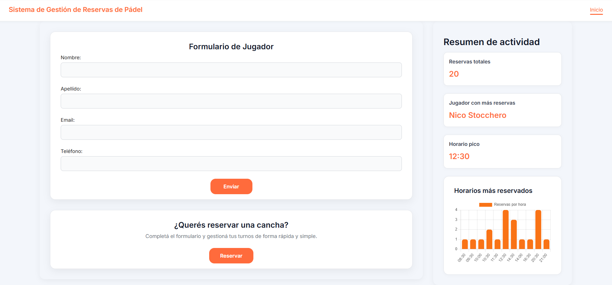
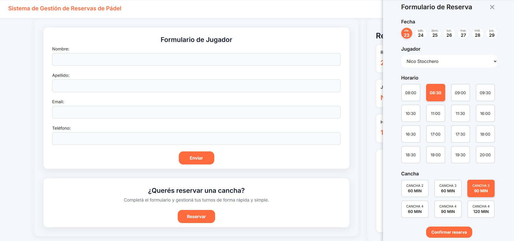
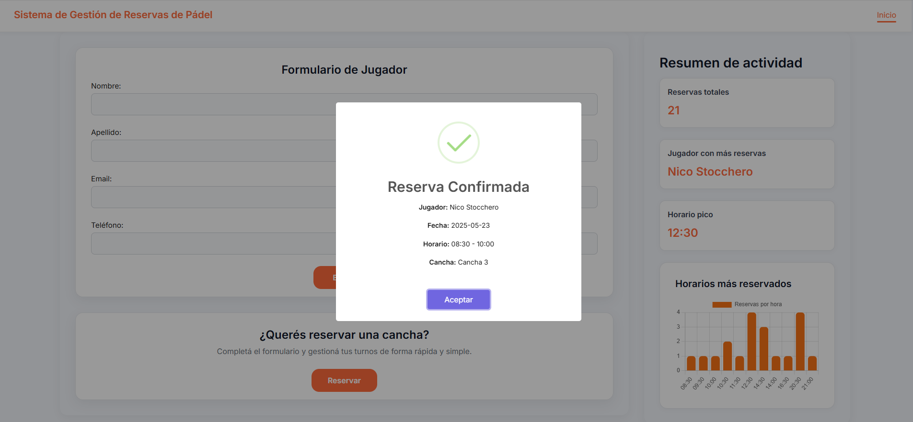
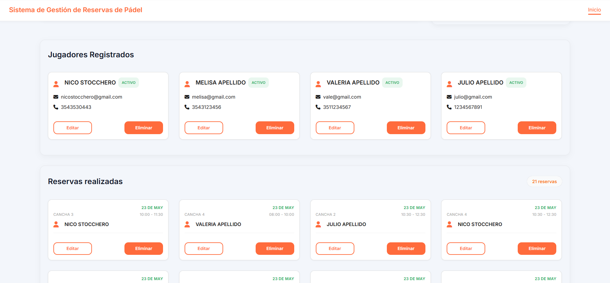

# Sistema de Gestión de Reservas de Padel

Este proyecto es una aplicación modular desarrollada con JavaScript puro, orientada a la gestión de jugadores y reservas de un club de pádel.

## 📌 Objetivo

Simular el flujo completo de un sistema de reservas con UX clara, validaciones y almacenamiento persistente en localStorage.

---

## 🧱 Estructura del proyecto

El proyecto está organizado por features (`jugadores`, `reservas`, `estadísticas`) siguiendo principios de separación de responsabilidades y escalabilidad.

### 📁 src/

- **features/**
  - `jugadores/`: lógica, almacenamiento y UI para la gestión de jugadores
  - `reservas/`: lógica de reservas, disponibilidad de canchas, validación de horarios y renderización del formulario
  - `estadisticas/`: generación de gráficos y métricas del uso de las canchas
- **shared/**
  - `helpers/`: funciones genéricas (fechas, listas, DOM)
  - `ui/`: componentes visuales reutilizables y handlers comunes
  - `validators/`: validadores de campos para cada módulo
- **data/**: simulación de datos externos (`canchas.json`, `storage.js`)
- **js/main.js**: punto de entrada principal de la aplicación

La estructura completa está dividida en capas internas:

- `data/`: acceso a datos (`localStorage`)
- `logic/`: validaciones, controladores y clases
- `ui/`: renderizado y lógica visual

Esto permite mantener independencia entre módulos y facilita la escalabilidad futura (como migrar a React, integrar nuevas funcionalidades o una base de datos real).

---

## ⚙️ Funcionalidades

### 🎯 Jugadores

- Alta de jugador con validación y normalización automática
- Visualización de jugadores activos
- Eliminación con confirmación y recarga automática

### 📅 Reservas

- Selección de jugador
- Generación dinámica de fechas disponibles
- Horarios según disponibilidad y lógica de superposición
- Canchas filtradas por fecha, hora y duración
- Confirmación y guardado en localStorage

---

## 🛠️ Tecnologías utilizadas

- JavaScript ES6+ (modular)
- SweetAlert2 (alertas y confirmaciones)
- FontAwesome (iconos)
- Day.js (formateo y manipulación de fechas)
- Chart.js (Generación de gráficos)
- localStorage (persistencia de datos)
- Estructura inspirada en Clean Architecture para frontend

---

## ✅ Buenas prácticas aplicadas

- Separación de lógica visual, lógica de negocio y datos
- Helpers genéricos reutilizables
- Código sin `console.log`, `alert`, ni lógica acoplada
- Comentarios útiles y funciones bien nombradas
- Modularidad escalable para futuros features

---

## 🧪 Cómo iniciar la app

1. Cloná o descargá el repositorio.
2. Abrí `index.html` en tu navegador.
3. El sistema se inicializa automáticamente desde `js/main.js`.

---

## 🖼️ Capturas de pantalla

### 📌 Pantalla principal con estadísticas y formulario de jugador

> Vista general del sistema, incluyendo el formulario de alta de jugador y estadísticas en tiempo real.

---

### 🧾 Formulario de reserva con selección de fecha, hora y cancha

> Interfaz para crear o editar reservas, con botones interactivos para elegir horario, duración y cancha disponible.

---

### 📋 Confirmación visual y validaciones

> Ejemplo de feedback visual mediante SweetAlert2 ante errores de validación o confirmación de acciones.

---

### 📂 Tarjetas de jugadores y reservas ya registradas

> Listado visual de reservas activas con opciones para editar o eliminar.

---

## 🙌 Autor

Desarrollado por **Nicolás Stocchero** como proyecto final para el curso de JavaScript en [Coderhouse](https://www.coderhouse.com/).

---

## 💬 Reflexión personal sobre el desarrollo

### 💡 Qué aprendí al desarrollar este proyecto

Muchas decisiones no las tomé desde el inicio, sino que fueron apareciendo a medida que el sistema crecía.

Por ejemplo, modularicé la lógica de botones (como `crearBotonDesdeItem`, `asignarEventoDeSeleccion`) al notar que estaba repitiendo lo mismo en distintos lugares. Eso me llevó a entender cómo abstraer patrones repetidos y desacoplar la UI por completo.

También aprendí que **la mejor forma de mantener el control sobre el código es escribir primero en pseudocódigo**, razonar los flujos, y recién después implementarlos. Eso me ayudó a refactorizar sin romper y a manejar estados complejos como `modoEdicion` sin confusión.

Y sobre todo, entendí que escribir código es solo una parte del trabajo: nombrar bien, dividir bien, y pensar en mantenimiento es lo que convierte una solución funcional en una solución profesional.

---

### ⚙️ Mejoras implementadas

- Eliminé cualquier dependencia de `innerHTML`, `console.log` o `alert`, usando `createElement`, notificaciones visuales (`SweetAlert2`) y helpers personalizados
- Validación completa del formulario (estructura, campos requeridos, solapamiento de horarios)
- Uso de `dayjs`, `validator.js`, `chart.js`, `localStorage` y otras utilidades para lógica de negocio simulada
- Separación de responsabilidades en módulos reutilizables (`shared/`, `validators/`, `features/`)

---

### 🚧 Pendientes o aspectos a mejorar

- Evitar completamente los solapamientos al editar una reserva si se cambia horario
- Testear y blindar condiciones límite de disponibilidad (última hora del día)
- Refactorizar algunos nombres para mayor claridad (`FormController` podría dividirse en partes)
- Migración progresiva a React como siguiente paso del proyecto

---

### 🔎 Qué me dejó este proyecto

Más allá del código, este proyecto me enseñó que **siempre hay una forma más clara, más limpia o más mantenible de escribir algo**.

Muchas decisiones que tomé no fueron porque “era lo correcto desde el principio”, sino porque **fui entendiendo la lógica paso a paso**, escribiendo primero en pseudocódigo, probando, y refactorizando después.

Me di cuenta de que **incluso cuando algo funciona, puede mejorar**.  
Y que **abstraer patrones, dividir responsabilidades y nombrar bien** no son detalles: son justamente lo que convierte un código frágil en uno mantenible.

Este fue mi primer sistema modular completo.  
No lo traté como un trabajo práctico: lo diseñé como si fuera una app real que alguien más pudiera usar, mantener y escalar.

---

### ⚠️ Nota para el revisor

Al editar una reserva, si se cambia el horario, puede haber conflictos para volver a seleccionar el mismo.  
Esto ocurre porque la lógica de disponibilidad recalcula en tiempo real las reservas activas, y no excluye la reserva que se está editando.

Preferí mantener este comportamiento para no sobreacoplar la lógica de edición.  
La alternativa implicaba introducir excepciones que hubieran hecho el código menos mantenible en esta etapa.

Es un detalle menor que no afecta el uso general, pero demuestra un punto clave: **entendí el problema y tomé una decisión informada al respecto**.
